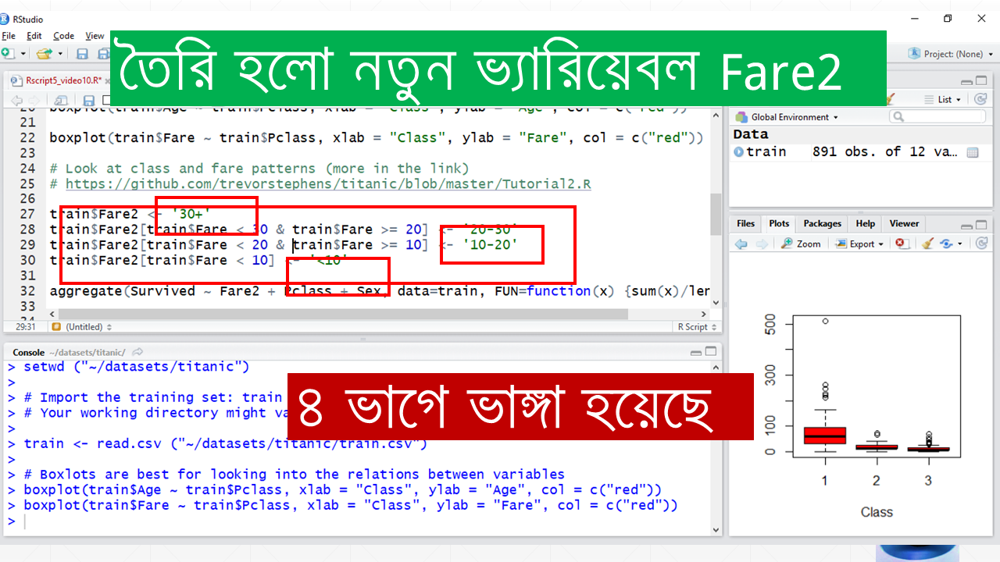
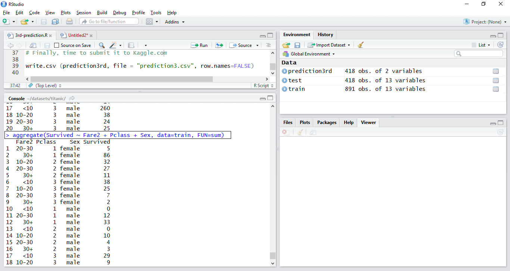
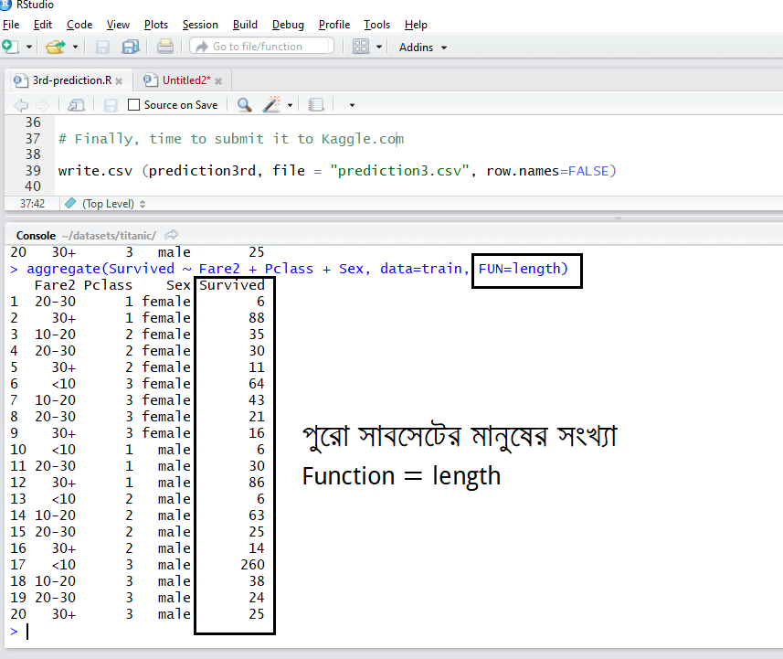
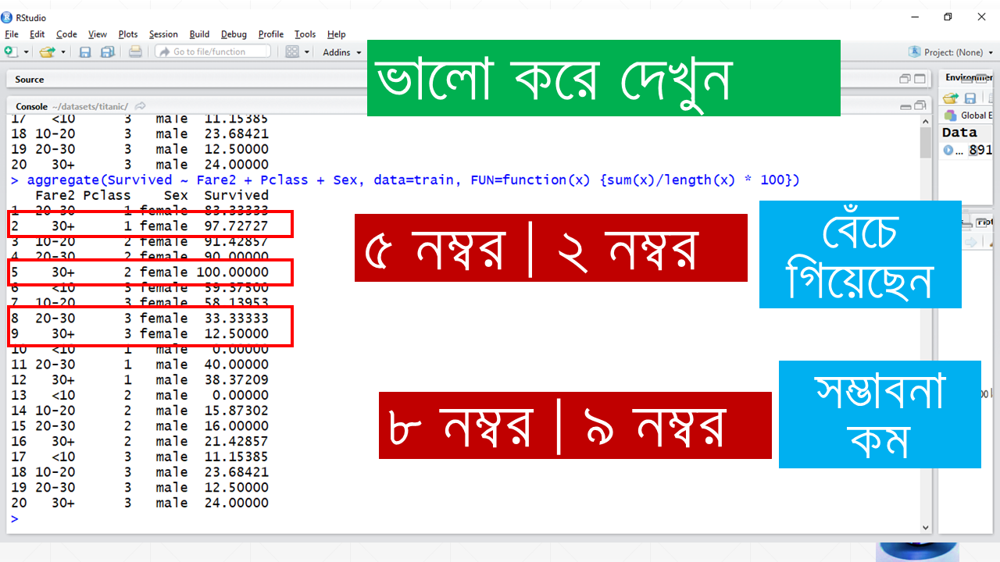

# ৭.৪. তৃতীয় প্রেডিকশন

## তৃতীয় প্রেডিকশন

মৃত্যুর সাথে টিকিটের দামের সম্পর্ক কোথায়? শুরুতে মনে হয়েছিল টিকিটের দামের সাথে মানুষের মৃত্যুর সম্পর্ক - সম্ভব কি সেটা? সেটা দেখতে খুলে দেখলাম সম্পর্কিত কাছাকাছি দুটো ভ্যারিয়েবল। তার মধ্যে একটা হচ্ছে জাহাজ ভাড়া \(Fair\) আরেকটা হচ্ছে প্যাসেঞ্জার ক্লাস \(Pclass\)। ভালভাবে দেখলে দেখা যাবে, Pclass ভেরিয়েবলটার তিনটা ভ্যালু মোটে। ফার্স্ট, সেকেন্ড আর থার্ড ক্লাস। হিসেবেও সুবিধা। ঘ্যাঁচ করে ফেলা যায় টেবিলে। Fare ভ্যারিয়েবলটা দেখতেই চক্ষুচড়কগাছ। এতো পুরো কন্টিনিউয়াস ভ্যারিয়েবল। শত শত উল্টাপাল্টা সংখ্যা। বেশি সংখ্যাতে সমস্যা আমাদের। এক, টেবিলে ফেলা দুস্কর। দুই, ধারণা আসবে না খালি চোখে। কি করি, কি করি? সমাধানে এগিয়ে এলেন ট্রেভর স্টিফেন্স। তার নোটবই নিয়ে। তৈরি করলেন নতুন ভ্যারিয়েবল। ভাড়ার বাচ্চা ভ্যারিয়েবল “Fare2”। আনকোরা নতুন ভ্যারিয়েবল বলে কথা। টেবিলে ফেলার জন্য ভাগও করা হলো ৪ ভাগে। চোখে পড়বে সহজে। সমস্যা একটাই। ভাড়া কিন্তু ক্লাসের ওপর ভিত্তি করে নয়। মানে, প্লেনের টিকেটের মতো। সময় ঘনায় - দাম বাড়ে। ক্লাসের দামে নয়।

তো, আলাদা করে ফেলি - ওই মানুষগুলোর সংখ্যা - যারা দিয়েছেন

১. ৩০ ডলারের ওপরের ভাড়া

২. ২০ থেকে ৩০ ডলারের ভাড়া

৩. ১০ থেকে ২০ ডলারের ভাড়া

৪. ১০ ডলারের নিচের ভাড়া

ব্যাপারটা লিখে ফেলি আর ষ্টুডিওতে। টেক্সট এডিটরে। তবে আপনাদের সাথে একটা চুক্তি ছিলো। কোন লেখালেখি নয়, আমাদের স্ক্রিপ্টটা লোড করে নিয়ে আসি ওয়ার্কিং ডিরেক্টরি থেকে। নাম: 3rd-prediction.R

> train$Fare2 &lt;- '30+'
>
> train$Fare2\[train$Fare &lt; 30 & train$Fare &gt;= 20\] &lt;- '20-30'
>
> train$Fare2\[train$Fare &lt; 20 & train$Fare &gt;= 10\] &lt;- '10-20'
>
> train$Fare2\[train$Fare &lt; 10\] &lt;- '&lt;10'

**ছবি: নতুন ভ্যারিয়েবল**মনে আছে আমরা প্রথম এবং দ্বিতীয় প্রেডিকশনে কিভাবে ডাটা দেখেছিলাম? ঠিক তাই, “টেবিল” কমান্ড দিয়ে। এরপর আমরা সেটাকে ‘প্রপোর্শন’ টেবিলে পার করে দিয়েছিলাম। ডাটাকে ঠিকমতো দেখার জন্য টেবিল বা ‘প্রপোর্শন’ টেবিলে অতটা জুৎসই নয়। যেমন, আমরা প্রথমে দেখতে চেয়েছিলাম কতজন মারা গিয়েছিলেন টাইটানিক জাহাজডুবিতে, অথবা বেঁচে গিয়েছিলেন। সেটাকে ঠিকমতো দেখা গিয়েছে টেবিল কমান্ডএর আউটপুট হিসেবে - আমাদের টার্গেট ভেরিয়েবলের পাশাপাশি। এরপর দেখতে চাইলাম মহিলা না পুরুষ? মানে, যারা বেঁচে গিয়েছেন তাদের মধ্যে কত সংখ্যক মহিলা ছিলেন? সেটাও পেয়েছি কিন্তু এই টেবিল কমান্ডের মাধ্যমে।

এখন যদি মহিলা পুরুষের ব্যাপারটার সাথে বয়সটাকেও যদি আমরা ‘প্রপোর্শন’ বা অনুপাত হিসেবে জানতে চাই, তাহলে আমাদের টেবিল কমান্ডটা পারবেনা এইক্ষেত্রে। এজন্য আমরা নতুন "আর" কমান্ড নিয়ে এসেছি aggregate - “এগ্রিগেট”। একটা জিনিস কিন্তু চিন্তা করতে হবে আমাদের সবসময়। আমাদের টার্গেট ভ্যারিয়েবল অর্থাৎ কে বেঁচে অথবা মারা গিয়েছিলেন, তার সাথে বের করতে হবে বিভিন্ন সাবসেটের হিসেব। মানে কত বয়সের মানুষজন বেশি মারা গিয়েছেন অথবা সে কি বাচ্চা ছিল কিনা অথবা যিনি মারা গিয়েছেন, তিনি কোথায় ছিলেন - কোন ক্লাসে - মহিলা হলে কতো বয়স ছিলো উনার, বড় পরিবারের ক্ষেত্রে কি ঘটেছিলো, তাদের পদবি কিভাবে সাহায্য করেছে বেঁচে যেতে, তাদের জাহাজের ভাড়া \(ক্লাস ভিত্তিক নয়\) কেমন ছিল, এ ধরনের অনেক প্রশ্ন জিজ্ঞাসা করতে হবে নিজেকে।

আমরা জানি যে পুরুষরা বেশি মারা গিয়েছেন, তাহলে বের করতে হবে মহিলাদের মধ্যে কোন “সাবসেট” মানে কোন অংশ বেশি মারা গেছেন? তার মধ্যে ক্রিটিক্যাল অংশ কতোটুকু? যেহেতু আমাদের নতুন “আর” কমান্ড হচ্ছে এগ্রিগেট, সেটার ফর্মুলাটাও বুঝতে চাই আমরা। আমাদের কমান্ড প্রথমে নেবে টার্গেট ভ্যারিয়েবল \($Survived\), কি পেতে যাচ্ছি আমরা। সেটাকে সে রাখবে সবচেয়ে বামে, তারপরে একটা “টাইলডি” = “~” চিহ্ন - পাশাপাশি ওইসব ভ্যারিয়েবলগুলোর নাম যেগুলোর সম্পর্ক আমরা বের করতে চাচ্ছি। আমাদের যতগুলো ভ্যারিয়েবলের মধ্যে সম্পর্ক বের করা দরকার সেগুলো আমরা সংযোগ করব যোগ \(+\) চিহ্ন দিয়ে। এরপর - আমরা বলব কোন ডাটাফ্রেমে দেখতে হবে আমাদের। সেই ডাটাফ্রেমে আমরা কি ধরনের "আর্গুমেন্ট" ব্যবহার করব সেটাও থাকবে সাথে। আর্গুমেন্ট কি এখানে? কমান্ডের মধ্যে দরকারি 'আর্গুমেন্ট' পাঠিয়ে দিলে অনেক কাজ সহজ হয়ে যায়।**ছবি: নতুন “আর” কমান্ড "এগ্রিগেট"**

আসি আজকের কমান্ডে। আমাদের টার্গেট ভেরিয়েবল হচ্ছে “Survived” কলাম, এরপরে রাখছি “টাইলডি” মানে “~” চিহ্ন। তারপর রাখছি ওইসব ভ্যারিয়েবল যাদেরকে আমরা ধারণা করছি সংযোগ আছে মানুষের বাঁচা মরার সাথে। এরপর ডাটাফ্রেম হিসেবে দেখিয়ে দিচ্ছি আমাদের train ডাটাফ্রেমকে। শেষের আর্গুমেন্ট মানে ফাংশনে বলে দিচ্ছি পুরোটাই মানে প্রতিটা সাবসেট আসবে যারা বেঁচেছে তাদের সংখ্যার যোগফল হয়ে। এজন্যই এই আর্গুমেন্ট হচ্ছে “সাম” মানে যোগফল। যেহেতু আমাদের টার্গেট ভেরিয়েবল এর আউটকাম ০ আর ১, এখানে বের হয়ে আসবে আমাদের মোট বেঁচে যাওয়া মানুষের সংখ্যা - সাবসেট ধরে। ভালো কথা, পেলাম ডাটা আমাদের কথা মত, কিন্তু প্রতিটা সাবসেটে আসলে কতগুলো মানুষ ছিল সেটা কি জানা যাবে? আলবত যাবে। সেজন্য আমরা ব্যবহার করছি পরের কমান্ড। পাল্টেছি শুধু আর্গুমেন্ট। বলেছি বের করো আউটপুটের লেংথ। চমৎকার, আমরা পেয়ে গেলাম পুরো সাবসেটের মানুষের সংখ্যা।**ছবি: সাবসেট ধরে ধরে মানুষের সংখ্যা**

আমাদের দরকার একটা অনুপাত। ওই টেবিল এরমতো। তবে বেশি ভ্যারিয়েবল দিয়ে।

১. কি পেলাম প্রথম কমান্ডে?

> &gt; aggregate\(Survived ~ Fare2 + Pclass + Sex, data=train, FUN=sum\)

আমাদের মোট বেঁচে যাওয়া মানুষের সংখ্যা - একেকটা সাবসেট ধরে। মানে Fare2, Pclass আর Sexএর ভিত্তিতে।

২. কেন দরকার পড়লো দ্বিতীয় কম্যান্ড?

> &gt; aggregate\(Survived ~ Fare2 + Pclass + Sex, data=train, FUN=length\)

পুরো সাবসেটের মানুষের সংখ্যা, বেঁচে না মারা গিয়েছেন সেটা বিবেচ্য নয়। তাহলে বেঁচে যাওয়া মানুষ / পুরো সাবসেটের মানুষ = আমাদের দরকারি অনুপাত

তাহলে সেটার কমান্ড কি?

> &gt; aggregate\(Survived ~ Fare2 + Pclass + Sex, data=train, FUN=function\(x\) {sum\(x\)/length\(x\)}\)

এই পর্যন্ত প্রতিটা “এগ্রিগেট” কমান্ড থেকে যে আউটপুটগুলো এসেছে তার প্রতিটা আমাদের দেখা উচিত। সেখানে ভাল করে যদি আমরা দেখি তাহলে প্রতিটা ভ্যারিয়েবলের এগেইনস্টে যে ডাটা এসেছে সেগুলো বেশ "ইনসাইটফুল"। এখনকার এগ্রিগেটের একটা ছবি দেখি বরং। **ছবি: কথা বলছে ডাটা**

ডাটা থেকে কিছু জ্ঞান নেই। সিরিয়াল নম্বর ধরে কথা বলি বরং।

যারা বেঁচেছেন বেশি তাদের দিয়ে শুরু;

_৫. যিনি মহিলা, ২য় শ্রেণীর যাত্রী এবং ৩০ ডলারের বেশি দিয়ে টিকেট কিনেছিলেন - তারা বেঁচেছেন সবাই। ১০০% বেঁচেছেন।_

_২. আবারো যিনি মহিলা, ১ম শ্রেণীর যাত্রী এবং আবারো ৩০ ডলারের বেশি টিকেটধারীরা বেঁচেছেন ৯৮%, এটাও বেশ ভালো।_

_পুরুষদের ব্যাপারে বলছি না আর। দেখতেই পাচ্ছেন হিসেবে। খুব খারাপ অবস্থা। আবার মহিলাদের মধ্যে যাদের সম্ভাবনা ছিল অনেক কম সেটাও দেখার বিষয়।_

_৮, ৯ সিরিয়ালের মহিলা, যারা ৩য় শ্রেণীর যাত্রী, ২০ ডলারের বেশি দিয়েছিলেন ভাড়া হিসেবে - তারাও ধরতে পারেন নি লাইফবোট।_

_কেন? সেটাই তো বলছে ডাটা।_

চলুন তৈরি করি আজকের প্রেডিকশন। আমাদের ৩য় প্রেডিকশন ওপরের ধারণা থেকে -

> test$Survived &lt;- 0 \#\# \[সবাই মারা গিয়েছেন\]
>
> test$Survived\[test$Sex == 'female'\] &lt;- 1 \#\# \[শুধু মহিলারা বেঁচেছেন\]
>
> test$Survived\[test$Sex == 'female' & test$Pclass == 3 & test$Fare &gt;= 20\] &lt;- 0 \#\# \[মারা গিয়েছেন শুধু ওই মহিলারা, ৩য় শ্রেণীর আর ২০ ডলারের বেশি টিকেটের দাম দিয়েছেন যারা\]

## সাবমিশন ফাইল তৈরি

নতুন করে বলতে হবে কিছু? স্ক্রিপ্ট থেকে তুলে দিচ্ছি বরং।

> prediction3rd &lt;- data.frame \(test$PassengerId, test$Survived\)
>
> names \(prediction3rd\) &lt;- c\("PassengerId","Survived"\)
>
> rownames \(prediction3rd\) &lt;- NULL
>
> write.csv \(prediction3rd, file = "prediction3.csv", row.names=FALSE\)

## ক্যাগলে আপলোড

অনুগ্রহ করে দেখুন প্রথম আর দ্বিতীয় প্রেডিকশনের অংশ।

## ব্যবহৃত গিটহাব স্ক্রিপ্ট \(অনলাইন\)

[https://github.com/raqueeb/mltraining/blob/master/ML-workbook/3rd-prediction.R](https://github.com/raqueeb/mltraining/blob/master/ML-workbook/3rd-prediction.R)

