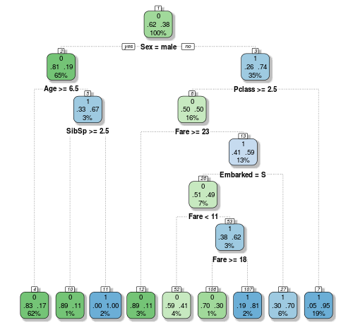

# ৭.৬. চতুর্থ প্রেডিকশন \(মেশিন লার্নিং\)

## চতুর্থ প্রেডিকশন \(মেশিন লার্নিং\)

চলুন তাহলে তৈরি করা যাক মেশিন লার্নিং এর প্রথম মডেল। রেডি তো? আগের মডেলগুলো আমরা তৈরি করেছিলাম ম্যানুয়ালি, এখন মেশিন লার্নিং এর সুযোগ নিয়ে তৈরি করা যাক আমাদের এই মডেল। তো আগে কি করেছিলাম? কয়েকটা “প্রপোরশন” টেবিল এবং “এগ্রিগেট” করে কয়েকটা চোখে লাগা ভেরিয়েবলে র ভিতর তুলনা করছিলাম - মহিলা পুরুষ, বয়স, যাত্রীর বিভিন্ন ক্লাস আর ভাড়া নিয়ে। এখন যেহেতু মেশিন লার্নিং নিয়ে কাজ শুরু করেছি, কিছুটা লোড দিয়ে দেই বাকি ভেরিয়েবলগুলোকে নিয়ে। আমরা সময়ের অভাবে বেশ কিছু ভেরিয়েবল দেখিনি আগে। এখন সেটা দেখে নেব নতুন কমান্ডে। দেখি আমাদের নতুন “ডিসিশন ট্রি” কি করে? আমাদের নতুন ফাংশন হিসেবে আসছে rpart, একটা প্রেডিক্টিভ এলিমেন্ট। বেশ মজার।

> \# তৈরি করি নতুন ট্রি - তবে এটা বেশ গভীরের
>
> mytree3 &lt;- rpart\(Survived ~ Pclass + Sex + Age + SibSp + Parch + Fare + Embarked, data=train, method="class"\)
>
> \# প্লট করি সাধারণ বিল্ট-ইন "আর" প্যাকেজ দিয়ে
>
> plot\(mytree3\)
>
> text\(mytree3\)
>
> \# আমাদের প্রিয় রিপোর্টিং টুল
>
> fancyRpartPlot\(mytree3\)

প্লট করে ফেললাম আমাদের নতুন “ট্রি”কে। এই “ট্রি” কিন্তু বেশ বড়ো হয়ে গেল আগের থেকে। কারণ - এখানে নিয়েছি অনেকগুলো ভেরিয়েবল। একটু বোঝার চেষ্টা করি ব্যাপারটা। কাছে থেকে। এখানে ভাই-বোন “সিবলিং”এবং “স্পাউসে”র "SibSp" যে ভেরিয়েবলটা ছিল সেটার সম্ভাবনাও বেশ ভালোই এসেছে। তার পাশাপাশি উঠে এসেছে কোন কোন জায়গা থেকে যাত্রীরা উঠেছিলেন। যেখানে “পুরুষ” যাত্রী হিসেবে ভাগ হয়ে গিয়েছেন, সেখানে ছয় বছরের নিচের বাচ্চাদের বেঁচে যাবার সম্ভাবনা বেড়েছে - যা অনেকটাই বেশি। প্রতিটা ডাইভার্শন বলছে সেখানে কত শতাংশ সম্ভাবনা যোগ করছে এই মডেলকে। আপনারাও বের করতে পারবেন বাকি অনেক কিছু।  

**ছবি: আমাদের ডিসিশন ট্রি - টাইটানিক ডাটাসেট, পুরো অংশ ধরে**

চলুন তৈরি করে ফেলি আজকের প্রেডিকশন। এখানে আমরা ডেকে নিয়ে আসছি “আরপার্ট” "rpart\(\)" এর নতুন প্রেডিক্ট ফাংশন। আমাদের দরকার বাইনারি ক্লাসিফিকেশন অর্থাৎ “০” অথবা “১” - উনি বেঁচে গিয়েছেন না মারা গিয়েছেন। সেই উত্তরটাকে লিখে ফেলা হয়েছে আগের প্রেডিকশনগুলোর মতো করে। তৈরি হয়েছে আমাদের নতুন প্রেডিকশন ফাইল। এরপর সেটাকে আপলোড করে দেব ক্যাগলে।

> prediction4th &lt;- predict\(mytree3, test, type = "class"\)
>
> prediction4 &lt;- data.frame\(PassengerId = test$PassengerId, Survived = prediction4th\)
>
> write.csv\(prediction4, file = "tree1.csv", row.names = FALSE\)

কি এলো রেজাল্ট?

## ব্যবহৃত গিটহাব স্ক্রিপ্ট \(অনলাইন\)

[https://github.com/raqueeb/mltraining/blob/master/ML-workbook/4th-prediction.R](https://github.com/raqueeb/mltraining/blob/master/ML-workbook/4th-prediction.R)

